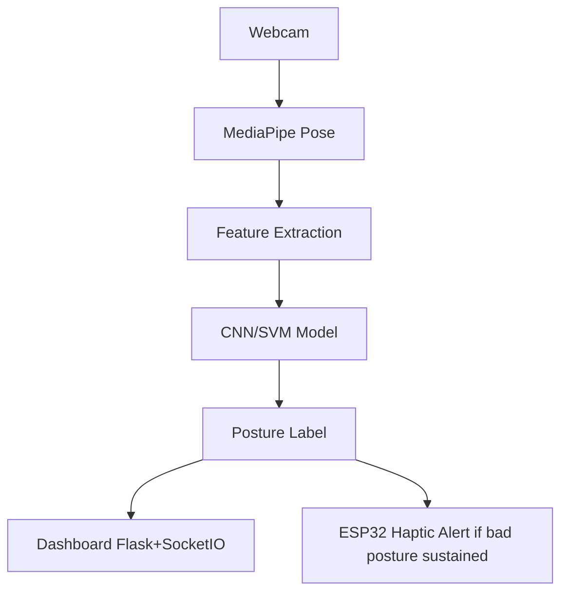

# Project Angelina — Neural-Ergonomic Focus Bot

Project Angelina is a real-time, AI-powered posture monitoring system designed to promote neural-ergonomic focus. Using a standard webcam, it analyzes skeletal landmarks via MediaPipe and classifies your posture into categories like `good_posture`, `slouching`, or `tech_neck`. 

When poor posture is detected over a sustained period, the bot sends an alert to an ESP32 microcontroller to trigger haptic feedback (a vibration motor and a buzzer), gently reminding you to correct your posture. It also features a real-time web dashboard to visualize your posture statistics.

## Features

- **Real-Time Posture Detection:** Uses OpenCV and MediaPipe Pose to extract body landmarks.
- **Machine Learning Models:** Supports both Convolutional Neural Network (CNN) and Support Vector Machine (SVM) models for accurate classification.
- **Haptic Feedback Integration:** Communicates with an ESP32 microcontroller via Serial to provide physical alerts when slouching or "tech neck" is detected.
- **Live Web Dashboard:** A Flask + SocketIO dashboard (`http://localhost:5001`) to track posture sessions, confidence scores, and alert logs in real-time.
- **Data Collection Tool:** Built-in tool for capturing and labeling your own posture data to train custom models.



## Project Structure

- `1_data_collector.py`: Collects skeletal landmarks from the webcam and saves them to `posture_dataset.csv`.
- `2_train_cnn.py` / `2_train_svm.py`: Scripts to train the CNN and SVM models using the collected dataset.
- `3_realtime_inference.py` / `3_svm_inference.py`: Runs real-time inference on the webcam feed and sends triggers to the ESP32 and Dashboard.
- `esp32_haptics/esp32_haptics.ino`: Arduino sketch for the ESP32 to receive Serial commands and trigger the motor/buzzer.
- `5_dashboard.py`: Runs the real-time web dashboard.
- `6_evaluation.py` / `6b_ablation_study.py` / `7_compare_models.py`: Scripts for model evaluation and comparison.
- `utils.py`: Shared utilities module (feature extraction, serial management, HUD drawing).
- `config.py`: Centralized runtime configuration (reads from environment variables).
- `requirements.txt`: Python dependency list with version bounds.
- `SECURITY.md`: Security and privacy documentation.
- `LICENSE`: MIT License.
- `*.bat`: Convenient batch scripts to quickly run the various Python scripts.

## Installation & Setup

### Prerequisites

1. **Python 3.x**
2. **Arduino IDE** (for flashing the ESP32)

### 1. Python Dependencies

Install the required Python packages:

```bash
pip install -r requirements.txt
```

*(Note: TensorFlow is required if using the CNN model. For SVM only, `scikit-learn` is sufficient).*

### 2. ESP32 Hardware Setup

1. Connect your ESP32 to your computer.
2. Wire up the hardware:
   - **GPIO 18:** Transistor Base (for vibration motor)
   - **GPIO 19:** Buzzer (+)
3. Open `esp32_haptics/esp32_haptics.ino` in the Arduino IDE and flash it to your ESP32.
4. Note the COM port of your ESP32 (e.g., `COM3` on Windows, `/dev/ttyUSB0` on Linux). The Python script will automatically attempt to find it or you can specify it in the inference script.

## Configuration

You can customize the application behavior via environment variables (see `config.py` for details). Key variables include:

- `ANGELINA_ESP32_PORT`: Set the COM port manually (e.g., `COM3`).
- `ANGELINA_ALERT_HOLD_S`: Time in seconds poor posture must be held before an alert triggers.
- `ANGELINA_COOLDOWN_S`: Cooldown time in seconds between alerts.
- `ANGELINA_DASHBOARD_PORT`: Port for the live dashboard (default is `5001`).

## Usage Guide

You can run the `.bat files` directly or use the terminal commands below.

### 1. Collect Data (Optional, for custom training)
```bash
python 1_data_collector.py
```
- Press `g` for good posture.
- Press `s` for slouching.
- Press `t` for tech neck.
- Press `q` to quit and save `posture_dataset.csv`.

### 2. Train the Model
```bash
# To train the CNN model
python 2_train_cnn.py

# To train the SVM model
python 2_train_svm.py
```

### 3. Run the Dashboard
Open a new terminal and start the dashboard server:
```bash
python 5_dashboard.py
```
Then navigate to `http://localhost:5001` in your web browser.

### 4. Start Real-Time Inference
In your main terminal, start the inference script:
```bash
python 3_realtime_inference.py
```
- The camera window will pop up. 
- Ensure your ESP32 is plugged in. If poor posture is detected for a sustained duration, the script will trigger the ESP32 to vibrate/beep.
- Press `q` to quit.

## Model Evaluation

To evaluate and compare the performance of your trained models, you can run the evaluation scripts:
```bash
python 6_evaluation.py
python 7_compare_models.py
```
These will generate metrics like confusion matrices and classification reports.

## License

This project is licensed under the MIT License. See the `LICENSE` file for details.
